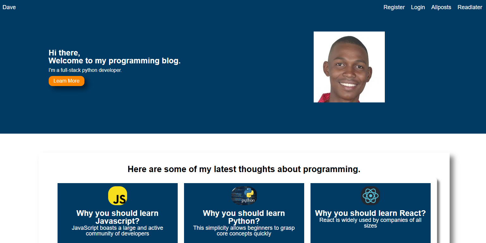
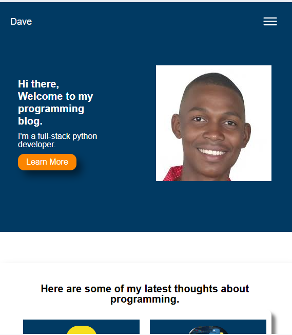

# Django Blog Project

This is a fully functional and responsive  blog application built with Django, HTML/CSS, Javascript and MySql.

In this project users can view blog Posts, leave comments/edit and delete them, create profile and explore a clean UI.

## 🚀 Features

--✅ Create, update, and delete blog posts(admin side)
--✅ Comment system
--✅ Resposive design with css media queries
--✅ Custom error pages
--✅ URL routing and slug system
--✅ Media and static file handling

## Tech Stack

-- Python
-- Django
-- HTML/CSS
-- Javascript
-- MySql 

1. ** Clone the repository
--bash
git clone https://github.com/WilkensonDave/django-blog.git
cd blogproject

2. Create a virtual environment and activate it:

python -m venv env
source env/bin/activate     # On Windows: env\Scripts\activate

3. Install dependencies:
pip install -r requirements.text

4. Run the server:
py manage.py runserver

5. Visit
http://127.0.0.1:8000/

Author
Wilkenson Devariste
